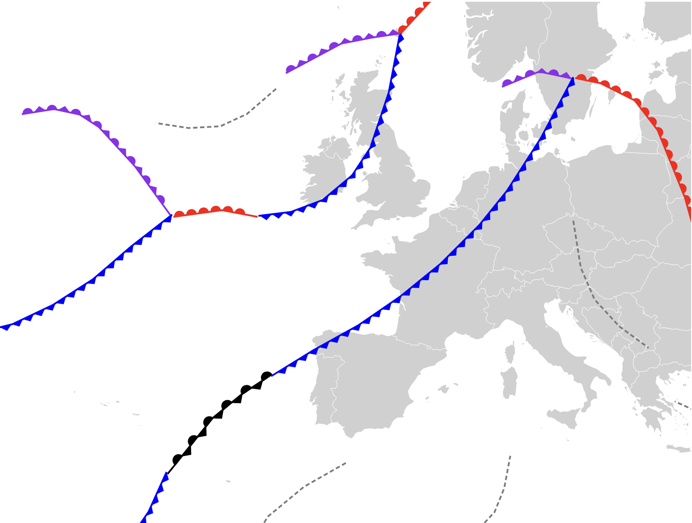

# D3 Weather Maps
Uses IAC fleetcode to render surface pressure charts using D3.
For more information on the different types of weather fronts and their effects see this [Met Office](https://www.metoffice.gov.uk/weather/learn-about/weather/atmosphere/weather-fronts) aricle.



## Dev Setup
To get up and running a nodejs and pnpm install is required.
```
pnpm install
pnpm run dev
```

## Todo
- [x] Render frontal paths and symbols
- [ ] Add setups to convert IAC fleetcode to geojson format
- [X] Fix Stationary front colour rendering
- [X] Render High and Low Pressure points