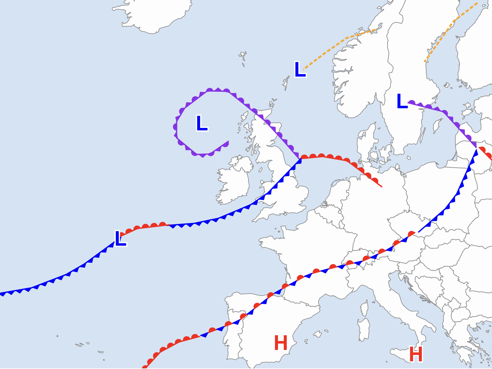

# D3 Weather Maps
Uses IAC fleetcode to render surface pressure charts using D3.



## Dev Setup
To get up and running a nodejs and pnpm install is required.
```
pnpm install
pnpm run dev
```

## Todo
- [x] Render frontal paths and symbols
- [ ] Add setups to convert IAC fleetcode to geojson format
- [ ] Fix Stationary front colour rendering